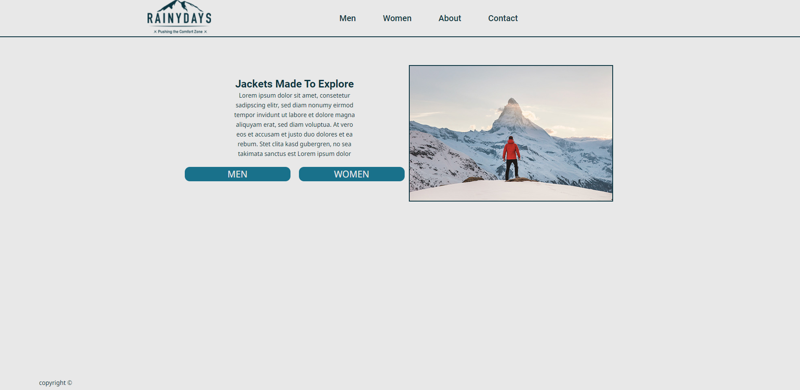

# Rainydays



## Description
the project is a school project which meant to be learned from and graded. it started of with a focus on design, Then a course in HTML and CSS. finaly we stareted on JavaScript. the project were a great learning experience.

## Built With

- HTML
- CSS
- JavaScript

## Getting Started

### Installing

1. Clone the repo:

```bash
git clone git@github.com:NoroffFEU/portfolio-1-example.git
```

2. Install the dependencies:

```
npm install
```

### Running

To run the app, run the following commands:

```bash
npm run start
```

## Contributing

This is the 

Here you can detail any information you want to provide regarding contributing to the project. For big projects you will usually have a separate `CONTRIBUTING.md` and link to it, but for smaller projects you can simply include instructions here. These instructions can simply detail the process you want a person to take, such as to make sure to open a pull request so code can be reviewed.

## Contact

[My Twitter page](https://twitter.com/EmilHatland)

[My Email](mailto:petter.mikalsen.pehm@mail.com)
